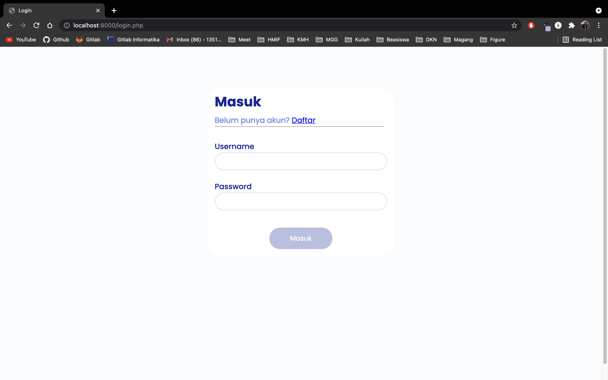

# Dorayaki Store / Monolithic Web Application 
## Semester I Tahun 2021/2022 

### Tugas Besar I & II IF3110 Milestone 1 Pengembangan Aplikasi Berbasis Web

*Program Studi Teknik Informatika* <br />
*Sekolah Teknik Elektro dan Informatika* <br />
*Institut Teknologi Bandung* <br />

*Semester I Tahun 2021/2022*

## Author
1. Gde Anantha Priharsena (13519026)
2. Reihan Andhika Putra (13519043)
3. Reyhan Emyr Arrosyid (13519167)

## Requirements
- [PHP 8](https://www.python.org/downloads/)

## Instalasi dan Menjalankan Server
### XAMPP
1. Jika anda belum mempunyai XAMPP maka install XAMPP terlebih dahulu menurut OS yang anda punya. Cara penginstalan bisa cek [disini](https://www.apachefriends.org/download.html)
2. Jalankan XAMPP.
3. Pindahkan isi dari repositori ini ke path htdocs dari xampp yang telah diinstall. 
4. Pastikan anda menginstall PHP (bisa include di XAMPP atau secara terpisah) dan pastikan versi dari php adalah versi 8.xx
5. Carilah file "php.ini" dan cari semua line dengan kata kunci "sqlite","soapClient", hilangkan ";" di depan line tersebut agar php bisa menggunakan extension sqlite3.
6. Jalankan ulang XAMPP.
7. Bukalah index dari aplikasi ini melalui melalui path htdocs kalian, anda harusnya diarahkan ke halaman login/register.
8. Lakukanlah seeding dengan mengakses
   - [path htdocs XAMPP kalian]/db/down.php, dilanjut dengan
   - [path htdocs XAMPP kalian]/db/down.php, dan dilanjut dengan
   - [path htdocs XAMPP kalian]/db/seed.php.
9. Kembalilah ke halaman index aplikasi ini, lalu anda bisa login sebagai admin atau sebagai user, atau anda bisa melakukan register akun baru.
10. Selamat mencoba

### Docker
1. Jika anda belum mempunyai docker maka install docker terlebih dahulu menurut OS yang anda punya. Cara penginstalan bisa cek [disini](https://docs.docker.com/engine/install/)
2. Apabila sudah terinstal, jalankan command dibawah ini. 
```
docker-compose -f deployments/compose/docker-compose.yml up
```
3. Bukalah http://localhost:8080/ di browser favorit anda. Anda harusnya diarahkan ke halaman login/register saat mengakses url tersebut.
4. Lakukanlah seeding database dengan mengakses url 
   - http://localhost:8080/db/down.php, dilanjut dengan
   - http://localhost:8080/db/up.php, dan dilanjut dengan
   - http://localhost:8080/db/seed.php.
5. Kembalilah ke http://localhost:8080/ lalu anda bisa login sebagai admin atau sebagai user, atau anda bisa melakukan register akun baru.
6. Selamat mencoba.

## Screen Capture 
### Login

### Register

### Dashboard


### Hasil Pencarian

### Penambahan Varian Dorayaki

### Detail Varian Dorayaki


### Pembelian Dorayaki

### Pengubahan Stok Dorayaki

### Riwayat Pengubahan Stok Dorayaki


### Riwayat Pembelian Dorayaki


# Tubes 2
## Deskripsi
Aplikasi ini adalah web marketplace lanjutan dari tubes 1. Perbedaanya adalah dalam manajemen stok dan pembuatan dorayaki baru terintegrasi dengan pabrik (Dorayaki Factory Server/Client)

## Fungsional Tambahan Aplikasi
1. Request resep dorayaki yang ada di factory (Melewati interface supplier)
2. Request penambahan stok dorayaki (Melewati interface supplier)
3. Admin tidak bisa mengubah stok dorayaki kecuali request ke factory (Melewati interface supplier) dan tidak bisa mengubah nama dari suatu dorayaki 
   
## Pembagian Tugas
Server-side
- Request resep dorayaki : 13519043
- Request tambah stok dorayaki : 13519043
- Validasi terkait stok dan nama dorayaki : 13519043

Client-side
- Validasi terkait stok dan nama dorayaki : 13519043

# Tubes 1
## Deskripsi
Aplikasi ini adalah web marketplace sederhana yang menjual produk dorayaki. Pengguna terdiri dari user
dan admin. User dapat melihat varian dorayaki yang dijual dan membeli dorayaki tersebut. Admin dapat
menambah varian dorayaki dan mengubah stok dorayaki. Aplikasi dibuat menggunakan Javascript, HTML, CSS, PHP, dan SqLite.
## Fungsional Aplikasi
1. Autentikasi Pengguna
2. Pengelolaan Varian Dorayaki
3. Manajemen Stok Dorayaki
4. Melihat Daftar Varian Dorayaki
5. Riwayat Perubahan Stok Dorayaki
6. Pembelian Dorayaki
7. Riwayat Pembelian Dorayaki

## Pembagian Tugas
Server-side
- Login : 13519167
- Register : 13519167
- Dashboard : 13519026, 13519043
- Hasil Pencarian : 13519026, 13519043
- Penambahan Varian Dorayaki Baru : 13519043 
- Detail Varian Dorayaki : 13519043
- Pembelian Dorayaki : 13519043, 13519167
- Pengubahan Stok Dorayaki : 13519043, 13519167
- Riwayat Pengubahan Stok Dorayaki : 13519043, 13519167
- Riwayat Pembelian Dorayaki : 13519043, 13519167
- Docker : 13519043

Client-side
- Login : 13519167
- Register : 13519167
- Dashboard : 13519026
- Hasil Pencarian : 13519026
- Penambahan Varian Dorayaki Baru : 13519043
- Detail Varian Dorayaki : 13519043, 13519167
- Pembelian Dorayaki : 13519043, 13519167
- Pengubahan Stok Dorayaki : 13519043
- Riwayat Pengubahan Stok Dorayaki : 13519043, 13519167
- Riwayat Pembelian Dorayaki : 13519043, 13519167
- Navigasi : 13519026
- Data Expire Time : 13519167
- Responsive Design : 13519026, 13519043, 13519167

